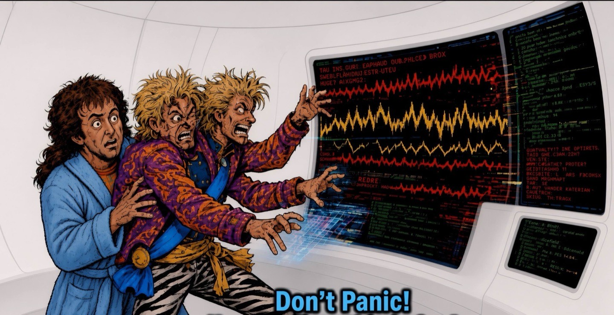

<p align="center">
  
</p>

<h1 align="center">Don't Panic!</h1>

<p align="center">
  <em>Skills required to navigate the improbability of AI! (towel optional)</em>
</p>

<p align="center">
  
  
  <a href="LICENSE"></a>
</p>

<p align="center">
  <a href="skills/dont-panic/SKILL.md">[dont-panic]</a>
  &middot;
  <a href="skills/bound-the-ask/SKILL.md">[bound-the-ask]</a>
  &middot;
  <a href="skills/pack-light/SKILL.md">[pack-light]</a>
  &middot;
  <a href="skills/prove-it/SKILL.md">[prove-it]</a>
  &middot;
  <a href="skills/find-the-fault/SKILL.md">[find-the-fault]</a>
  &middot;
  <a href="skills/subtract/SKILL.md">[subtract]</a>
</p>

<p align="center">
  <sub>Thinking guide</sub><br>
  <a href="thinking-tools.md#issue-trees">[Issue trees]</a>
  &middot;
  <a href="thinking-tools.md#inversion">[Inversion]</a>
  &middot;
  <a href="thinking-tools.md#abstraction-laddering">[Abstraction laddering]</a>
  &middot;
  <a href="thinking-tools.md#first-principles">[First principles]</a>
  &middot;
  <a href="thinking-tools.md#cynefin">[Cynefin]</a>
  <br>
  <a href="thinking-tools.md#ooda">[OODA]</a>
  &middot;
  <a href="thinking-tools.md#zwicky-box">[Zwicky box]</a>
  &middot;
  <a href="thinking-tools.md#minto-pyramid">[Minto Pyramid]</a>
  &middot;
  <a href="thinking-tools.md#test-bar">[Test bar]</a>
</p>

---

<p align="center">
  <strong>Bound the ask. Pack light. Prove it. Find the fault. Subtract.</strong><br>
  <sub>A small Agent Skills collection that bounds the scope, travels light, and refuses &ldquo;done&rdquo; without proof.</sub>
</p>

## Install

Works as a plugin on **Grok Build**, **Codex**, and **Claude Code**. Other agents discover skills from this repo (Cursor, Windsurf, OpenClaw, Hermes, and anything that scans `.agents/skills/`).

Commands and host matrix: [`install/README.md`](install/README.md) · [`install/paths.md`](install/paths.md)

```bash
# Grok Build
grok plugin marketplace add tony-sappe/dont-panic
grok plugin install dont-panic --trust

# Codex — then install Don't Panic from /plugins
codex plugin marketplace add tony-sappe/dont-panic

# Agent Skills via GitHub CLI
gh skill install tony-sappe/dont-panic --all
```

Claude Code: `/plugin marketplace add tony-sappe/dont-panic` then `/plugin install dont-panic@dont-panic`.

Local checkout, AGENTS.md snippet, and non-plugin hosts: see [`install/`](install/).

Start a **new session** (or reload) after install so the skills appear.

## Usage

After install, say the job in plain language (kebab ids also work: `bound-the-ask`, `pack-light`, …):

- **bound the ask** — ambiguous or multi-file work before coding
- **pack light** — design / new parts / YAGNI
- **prove it** — before calling something done or opening a PR
- **find the fault** — bugs, regressions, flaky tests
- **subtract** — delete or simplify without changing behavior

Examples:

```text
Bound the ask for adding SSO to this app.
Pack light for this design.
Prove it before you open the PR.
Find the fault — checkout fails on Safari only.
Subtract the unused auth helpers.
```

### Intensity

```text
dont-panic lite    # soft challenges, vibe-coding friendly
dont-panic full    # default
dont-panic ultra   # hard gates, failure-first, subtract hard
```

## Skills
Full instructions live in [`skills/`](skills/) (`SKILL.md` per skill).

| Skill | Job |
| --- | --- |
| `dont-panic` | Intensity dial + route map |
| `bound-the-ask` | Bounded contract before material work |
| `pack-light` | Smallest complete system you can trust |
| `prove-it` | Named evidence before "done" |
| `find-the-fault` | Observe → one hypothesis → one experiment |
| `subtract` | Behavior-preserving simplification |

Artifacts in the target project go under `specs/` (or `docs/specs/` when that tree already exists or the user asks for it).


## Contributing

```bash
./scripts/validate.sh
```

After editing skill bodies or OpenClaw blurbs:

```bash
./scripts/build-openclaw-skills.sh
```

## ...and Thanks for All the Fish!

<a href="https://ponytail.dev">[ponytail]</a> · <a href="https://github.com/obra/superpowers">[superpowers]</a> · <a href="https://github.com/bmad-code-org/BMAD-METHOD">[BMAD Method]</a> · <a href="https://github.com/sudoconnor/first-principles-engineering">[first-principles-engineering]</a>

([MIT](LICENSE))
