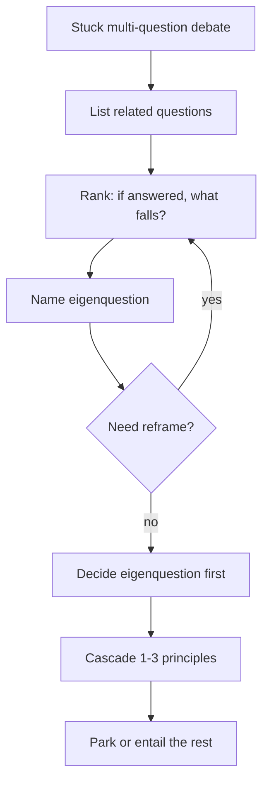

<!-- Generated by scripts/sync_references.py; do not edit. -->
<!-- Source: thinking-tools.md#eigenquestions -->

# Eigenquestions

Among a set of related questions, the **eigenquestion** is the most discriminating one — if answered, it answers or collapses the rest. Surface debates are often the wrong question. Use when stuck on a multi-question deadlock that should spawn a lasting principle — not on every ticket.

## How to use

1. Surface the deadlock; list related questions/choices (do not order by loudness).
2. Rank by: *if answered, what else falls?* Prefer discriminating over noisy.
3. Reframe if needed (rotate perspective; change the question).
4. Decide the eigenquestion first.
5. Cascade: write 1–3 principles/decisions that kill downstream bikesheds.
6. Park remaining questions as entailed or explicitly deferred.

**Stop:** one eigenquestion + ≥2 cascading decisions named; remaining items entailed or parked. **Not for every decision.**

## Shape

## Further reading

- Mehrotra & Hudson, [Eigenquestions: The Art of Framing Problems](https://docs.superhuman.com/@shishir/eigenquestions-the-art-of-framing-problems) (Superhuman handbook)
- Jenny Wen, [Figma Community: Eigenquestions](https://www.figma.com/community/file/1322597016029468610/eigenquestions)
