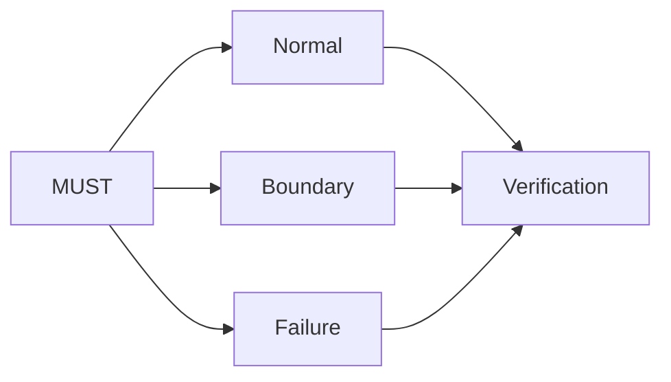

<!-- Generated by scripts/sync_references.py; do not edit. -->
<!-- Source: thinking-tools.md#specification-by-example -->

# Specification by example

Turn each important MUST into observable examples before implementation invents the behavior. Ambiguous words (“robust”, “fast”, “handles failure”) survive until a normal, boundary, and failure case exist. The examples are the contract’s testable surface; they are not a suggested implementation.

## How to use

1. For each important MUST, name actor, trigger, input, output, and failure behavior.
2. Write three examples: **normal**, **boundary**, **failure**. A MUST with no example that could fail is incomplete.
3. Keep required behavior separate from a proposed mechanism.
4. Link each example to a verification method. Not every example needs a unit test.
5. When the implementation drifts, update the example only if the user changed intent.

**Stop:** each important MUST has normal, boundary, and failure examples. Skip ceremonial examples on a one-line typo fix.

Failures to avoid: examples that only restate the MUST; rewriting examples to match an accidental implementation; treating a suggested library as a requirement.

## Shape

## Further reading

- [Cucumber: Example Mapping](https://cucumber.io/docs/bdd/example-mapping/)
- [NASA: writing good requirements](https://www.nasa.gov/reference/appendix-c-how-to-write-a-good-requirement/)
