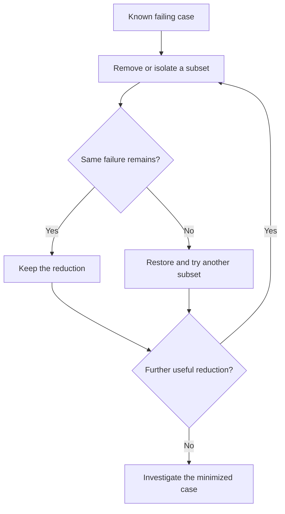

<!-- Generated by scripts/sync_references.py; do not edit. -->
<!-- Source: thinking-tools.md#fault-isolation -->

# Fault isolation

Narrow the location or conditions of a failure before inventing a hypothesis about the whole subsystem. Bisection searches an ordered space (commits) with a reliable good/bad test. Delta debugging shrinks a failing input or configuration while the same failure remains.

## How to use

1. Define the exact failure predicate. Establish repeatability.
2. Separate environment from the artifact under investigation.
3. Reduce: bisect history, or drop input/config subsets. Keep only reductions that preserve **this** failure.
4. Confirm the minimized case still matches the original symptom before using it to justify a fix.

**Stop:** a minimized reproducer plus evidence it is the same bug. Skip when the case is already tiny.

Failures to avoid: a reducer that preserves a different error; treating one flaky observation as binary; shotgun-patching the unreduced artifact.

## Shape

## Further reading

- [Zeller: Delta Debugging](https://www.debuggingbook.org/html/DeltaDebugger.html)
- [Git: bisect](https://git-scm.com/docs/git-bisect)
- [Google SRE: effective troubleshooting](https://sre.google/sre-book/effective-troubleshooting/)
