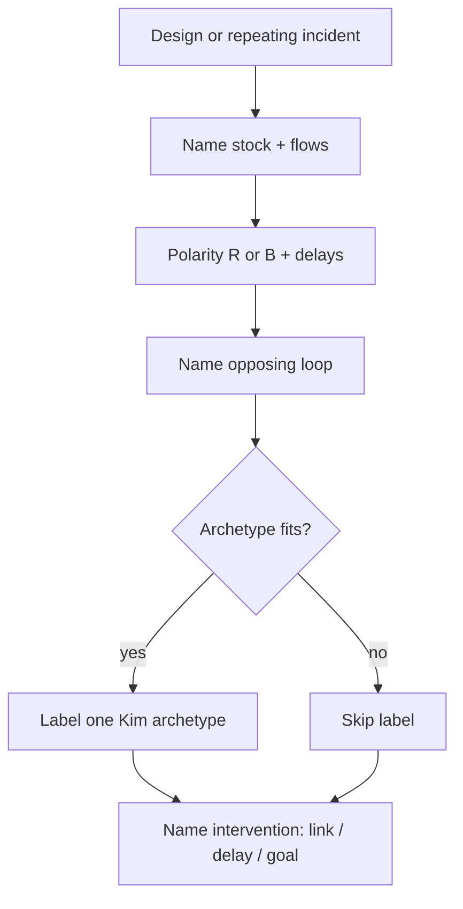

<!-- Generated by scripts/sync_references.py; do not edit. -->
<!-- Source: thinking-tools.md#feedback-loops -->

# Feedback loops

Name the stock, flow, polarity (reinforcing **R** / balancing **B**), delay, and opposing loop that will fight the design — retries, caches, autoscaling, incident spirals, capacity. Optionally label one Kim archetype when it fits. One primer, not ten systems files. Intervention must name which link, delay, or goal changes.

## How to use

1. Name the **stock** (accumulator) and **flows** that fill/drain it (Meadows bathtub).
2. Name polarity: **R** (amplifies) or **B** (goal-seeking). Mark significant **delays**.
3. Name the **opposing** loop (what fights or limits the first).
4. Optional: match **one** Kim archetype if it fits — Fixes That Fail; Shifting the Burden; Limits to Growth / Limits to Success; Drifting Goals; Escalation; Success to the Successful; Tragedy of the Commons; Growth and Underinvestment.
5. State the intervention: which link to add/break, delay to shorten, or goal to make explicit.

**Stop:** one loop with opposing force named; intervention names the structural change. No essay.

Failures to avoid: “users tell friends” as a reinforcing loop without a stock; drawing arrows with no stock/delay; minting Connection Circles / Iceberg as separate tools (fold here).

## Shape

## Further reading

- Daniel H. Kim, *Systems Thinking Tools: A User’s Reference Guide* (Pegasus Communications, 1994/2000) — CLD, R/B, archetypes
- Meadows Project, [Systems Thinking Resources](https://donellameadows.org/systems-thinking-resources/) (bathtub / stock–flow); [Bathtubs 101 PDF](https://donellameadows.org/wp-content/userfiles/bathtubs101.pdf)
