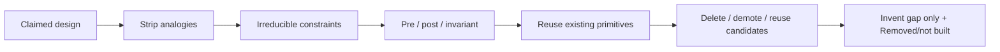

<!-- Generated by scripts/sync_references.py; do not edit. -->
<!-- Source: thinking-tools.md#first-principles -->

# First principles

Separate what is true in this situation from analogy (“this is how people do it”). A first principle here is an **irreducible constraint**: it still holds if the current design is deleted. Write keepers as Meyer contracts, map reuse, invent only the gap, then **delete before add**. Craftsmanship is less surface area and sharper contracts — not Musk anecdotes or Five Whys chains.

Prefer writing constraints as contracts (Meyer) over ritual “Five Whys.” After you have irreducibles, default to reusing primitives that already satisfy them. Addition-by-subtraction / Occam lives here, not as a separate tool; behavior-preserving cleanup of existing code still routes to `subtract`. Interrupted, retried, or concurrent transitions belong in [state machines](state-machines.md).

## How to rebuild from constraints

1. Name the claimed requirement or stack choice.
2. List constraints that remain if this design vanishes (physics, law, existing data contracts, SLO, threat model). Strike “how we did it last time.”
3. Write keepers as contracts:
   - **precondition** — caller must guarantee
   - **postcondition** — supplier must deliver
   - **invariant** — always true in observable states.
   Share policy definitions; keep independent validation at every required trust boundary. Remove a check only when it is redundant within the same trusted boundary; before deleting supplier-side enforcement, test a direct call that bypasses the caller.
4. For each invariant, name the existing primitive or library that already satisfies it. Reuse is the default.
5. **Delete before add.** Before inventing or growing lifecycle surface area: list what can be deleted, demoted, or reused. When net surface grows, require a `Removed / not built` note (or explicit “nothing to delete because…”).
6. Rebuild only the gap. Analogies (“like Netflix”) wait until steps 2–5 exist.
7. Failures to avoid: “users want speed” as an axiom; inventing what already exists (NIH); deleting tests or observability to “simplify.”

## Shape

## Further reading

- Meyer, [Applying “Design by Contract”](https://se.inf.ethz.ch/~meyer/publications/computer/contract.pdf) (*Computer*, Oct 1992)
- [What is First Principles Thinking? — Farnam Street](https://fs.blog/first-principles/) — irreducibles vs analogy (skip Five Whys as the method)
- [First Principles — James Clear](https://jamesclear.com/first-principles) (worked decomposition)
- [First principles — Untools](https://untools.co/first-principles/)
