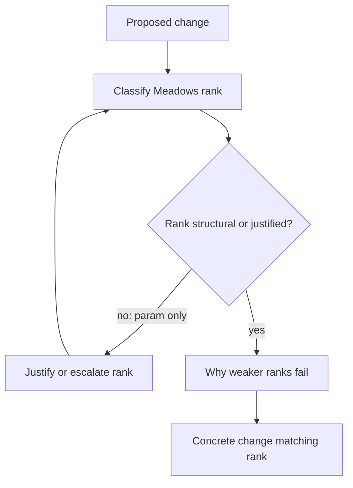

<!-- Generated by scripts/sync_references.py; do not edit. -->
<!-- Source: thinking-tools.md#leverage-points -->

# Leverage points

Meadows’ ranked places to intervene in a system (#12 weakest → #1 strongest). Agents tune parameters (#12) and call it architecture. Ask: are we changing a constant, a feedback, a rule, or a goal? Prefer structural interventions (add/break link, shorten delay, make goal explicit) over constants. Loops describe structure; leverage ranks intervention altitude — keep them separate from [feedback loops](feedback-loops.md).

## How to use

1. Classify the intervention against Meadows 12 (weak → strong):
   - **12** Constants, parameters, numbers
   - **11** Buffer sizes relative to flows
   - **10** Structure of material stocks and flows
   - **9** Lengths of delays relative to rate of change
   - **8** Strength of negative (balancing) feedback
   - **7** Gain around driving positive (reinforcing) feedback
   - **6** Structure of information flows (who sees what)
   - **5** Rules (incentives, constraints, permissions)
   - **4** Power to add/change/evolve/self-organize structure
   - **3** Goals of the system
   - **2** Mindset / paradigm
   - **1** Power to transcend paradigms
2. State why weaker ranks fail for this problem.
3. Prefer structural moves (≈ ranks 9–5, or goal #3 when genuine) over constants.
4. Write the concrete change that matches the claimed rank.

**Stop:** intervention matches the rank claimed; not “paradigm” as excuse to avoid a concrete change.

## Shape

## Further reading

- Meadows, [Leverage Points: Places to Intervene in a System](https://donellameadows.org/archives/leverage-points-places-to-intervene-in-a-system/)
- Kim, *Systems Thinking Tools* (Pegasus) — prefer structural interventions; pairs with ranks above
