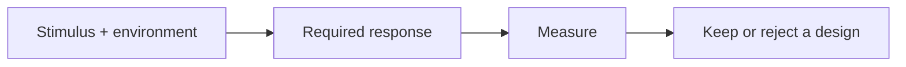

<!-- Generated by scripts/sync_references.py; do not edit. -->
<!-- Source: thinking-tools.md#quality-scenarios -->

# Quality scenarios

A quality attribute (“scalable”, “reliable”) is not a decision until it has a stimulus, an environment, a required response, and a measure. One scenario is enough to reject a survivor or keep the smallest design that still holds. This is not a full ATAM workshop.

## How to use

1. Name the quality in one line (latency, durability, availability, modifiability, …).
2. Fill: source of stimulus → stimulus → operating environment → affected part → required response → measure.
3. Compare surviving designs against hard constraints first, then preferences.
4. Record the assumption that would reverse the choice.

**Stop:** one scenario the winner must meet; ordinary CRUD skips this.

Failures to avoid: averaging away a hard requirement in a score; treating “microservices” as a quality; a scenario with no measure.

## Shape

## Further reading

- [SEI: reasoning about software quality attributes](https://www.sei.cmu.edu/library/reasoning-about-software-quality-attributes/)
- [SEI: steps in ATAM](https://www.sei.cmu.edu/library/steps-in-an-architecture-tradeoff-analysis-method-quality-attribute-models-and-analysis/)
- [Nygard: documenting architecture decisions](https://cognitect.com/blog/2011/11/15/documenting-architecture-decisions)
