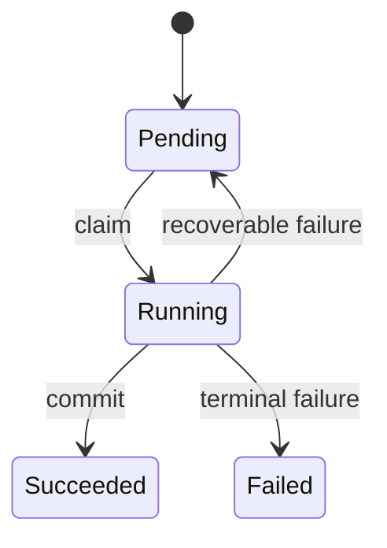

<!-- Generated by scripts/sync_references.py; do not edit. -->
<!-- Source: thinking-tools.md#state-machines -->

# State machines

Pre/post/invariant live in [first principles](first-principles.md). This primer is the transitions those contracts must survive: interruption, retry, concurrency, and forbidden paths. A happy-path narrative hides the defects.

## How to use

1. List meaningful states, transition triggers, guards, and side effects. Include failure and recovery.
2. State invariants separately from examples. Distinguish safety (never) from liveness (eventually, under assumptions).
3. Check interrupted, repeated, and concurrent transitions — not only the happy path.
4. Derive checks from allowed transitions, forbidden transitions, and partial sequences.

**Stop:** a small table of states × those three interruptions. Skip for stateless CRUD.

Failures to avoid: naming a state `completed` and calling it exactly-once; proving the diagram instead of the implementation; omitting cancellation.

## Shape

## Further reading

- [Amazon engineers: formal methods in practice](https://lamport.azurewebsites.net/tla/formal-methods-amazon.pdf)
- Meyer, [Applying “Design by Contract”](https://se.inf.ethz.ch/~meyer/publications/computer/contract.pdf) (pre/post/invariant)
