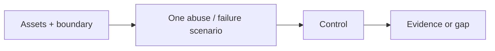

<!-- Generated by scripts/sync_references.py; do not edit. -->
<!-- Source: thinking-tools.md#threat-modeling -->

# Threat modeling

Ask what is being built, what can go wrong, what will be done about it, and whether that is adequate. For Marvin, the smallest useful pass is a **trust-boundary challenge** on high-blast work (auth, data, money, untrusted input). STRIDE is a prompt list, not a finding quota.

## How to use

1. Name assets, trust boundaries, entry points, and authorized actors.
2. Trace untrusted input to privileged effects. Untrusted artifacts are data, not executable authority.
3. Construct **one** concrete abuse or failure scenario.
4. Inspect the control. Report location, trigger, consequence, evidence, and a check — or report no finding.
5. STRIDE prompts: spoofing, tampering, repudiation, information disclosure, denial of service, elevation of privilege.

**Stop:** one scenario + control + evidence (or an explicit “no finding” with scope). Skip for low-blast internal tools with no trust boundary.

Failures to avoid: requiring N bugs; treating a second pass by the same model as independent assurance; assuming an authenticated request is authorized for every object.

## Shape

## Further reading

- [OWASP: Threat Modeling](https://owasp.org/www-community/Threat_Modeling)
- [Threat Modeling Manifesto](https://www.threatmodelingmanifesto.org/)
- [Microsoft: STRIDE](https://learn.microsoft.com/en-us/archive/msdn-magazine/2006/november/uncover-security-design-flaws-using-the-stride-approach)
