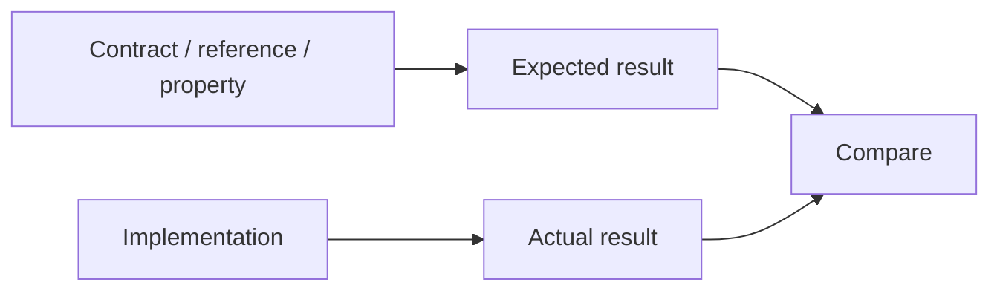

<!-- Generated by scripts/sync_references.py; do not edit. -->
<!-- Source: thinking-tools.md#independent-oracles -->

# Independent oracles

[Test bar](test-bar.md) chooses the layer. This primer chooses the **expected result**. A check whose oracle is the implementation under test can only reproduce the same mistake.

## How to use

1. Name where the expected result comes from: the contract / example, a trusted reference, or an independently derived property.
2. If it was read from the code under test, it is not an oracle. Get it from the MUST, a fixture, a spec, or a property that would still hold if this code were deleted.
3. Do not weaken the assertion, timeout, or error report to make the check pass.
4. A regression test should fail for the defect it claims to catch.

**Stop:** every material check has a named oracle source. Skip restating this on a proof that already cites the contract example.

Failures to avoid: round-trip tests that both sides get wrong the same way; snapshots that lock implementation; “the test matches the code, so the code is correct.”

## Shape

## Further reading

- [Software Engineering at Google, ch.11 Testing Overview](https://abseil.io/resources/swe-book/html/ch11.html)
- [Google SRE: testing for reliability](https://sre.google/sre-book/testing-reliability/)
