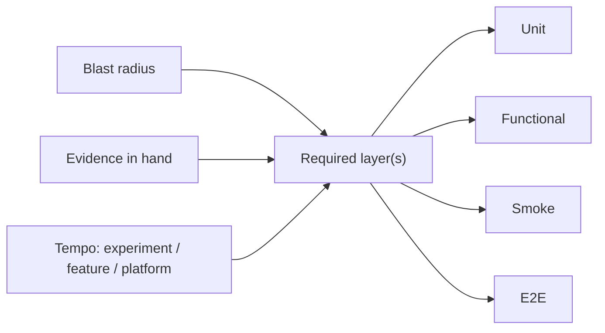

<!-- Generated by scripts/sync_references.py; do not edit. -->
<!-- Source: thinking-tools.md#test-bar -->

# Test bar

Untools / Chu ask “how confident am I in the problem and the solution?” For engineering work, rewrite the gate as:

**blast radius × evidence already in hand → required test layer**

A failing test is not value; a fix is. The ideal feedback loop is fast, reliable, and isolates the failure. Chu’s Experiment / Feature / Platform model still governs *tempo*. Fowler’s pyramid is the familiar cartoon, not the whole gate. Where the expected result comes from is [independent oracles](independent-oracles.md).

## Layers

- **Unit** — isolated logic, fast, pins a corner. Default for pure functions. (SWE book *small*: one process, no I/O.)
- **Functional / integration** — several units together, real collaborators; mock the network not the design. (SWE book *medium*: one machine.)
- **Smoke** — the smallest deploy-blocking slice of the real system (health, login, one write-path). The e2e you refuse to skip.
- **E2E** — behaves like a user across the stack. Expensive and brittle. One per critical journey, not per ticket. (SWE book *large*: multi-machine.)

## How to choose

1. Name blast radius: who is hurt if this is wrong (data, auth, money, one internal tool).
2. Name evidence already in hand: repro rate, acceptance coverage, contract tests, last similar incident.
3. Name the kind of work: Experiment (optimize for learning) / Feature / Platform (quality bar is high).
4. Pick the **required** layer(s). High blast requires evidence of both boundary behavior (functional / integration) and the critical application path (smoke / e2e). One check may cover both claims if it actually exercises both; name that coverage. An unavailable path remains a reported gap, never an implicit waiver. Isolated change with strong unit evidence does not get a new browser suite.
5. Forbid duplicating lower-layer asserts at e2e. Thought experiment: you may write only 10 e2e — where?
6. If a high-level test fails, use the smallest faithful reproduction where feasible. Retain the boundary-level check when browser policy, deployment configuration, or distributed timing cannot be represented faithfully below it. Do not fabricate equivalent unit evidence.
7. Beyoncé rule: if you liked it, put a test on it.
8. Optional **RAT**: name the riskiest assumption → cheapest test that kills it.
9. Failures to avoid: confidence-as-logits; high confidence skips tests; low confidence skips shipping *and* skips tests; ice-cream cone of e2e. 70/20/10 is a first guess, not a quota.

## Shape

## Further reading

- Wacker, [Just Say No to More End-to-End Tests](https://testing.googleblog.com/2015/04/just-say-no-to-more-end-to-end-tests.html)
- [Software Engineering at Google, ch.11 Testing Overview](https://abseil.io/resources/swe-book/html/ch11.html) (small / medium / large; Beyoncé rule)
- Chu, [Product Management Mental Models](https://blackboxofpm.substack.com/p/product-management-mental-models-for-everyone-31e7828cb50b) (speed vs quality; Experiment / Feature / Platform)
- [Test Pyramid — Martin Fowler](https://martinfowler.com/bliki/TestPyramid.html)
- [Confidence determines speed vs. quality — Untools](https://untools.co/confidence-determines-speed-vs-quality/)
