# Thinking tools

Seventeen frameworks for framing problems, choosing designs, debugging, and deciding how much proof is enough. Each section is a standalone primer. These are the textbook; Marvin’s job skills (`bound-the-ask`, `pack-light`, `prove-it`, `find-the-fault`, `subtract`) are the recipes that invoke them. Do not mint a new top-level skill for each tool. Icons from [Untools](https://untools.co) where available.

## Where they show up in Marvin

| Tool | Bound the ask | Pack light | Prove it | Find the fault | Subtract |
| --- | :---: | :---: | :---: | :---: | :---: |
| [Cynefin](#cynefin) | x | | | x | |
| [Eigenquestions](#eigenquestions) | x | | | | |
| [Issue trees](#issue-trees) | | | | x | |
| [Abstraction laddering](#abstraction-laddering) | x | | | | |
| [First principles](#first-principles) | | x | | | x |
| [Zwicky box](#zwicky-box) | | x | | | |
| [OODA](#ooda) | | | | x | |
| [Minto Pyramid](#minto-pyramid) | x | | | | |
| [Test bar](#test-bar) | | | x | | |
| [Feedback loops](#feedback-loops) | | x | | x | |
| [Leverage points](#leverage-points) | | x | | | |
| [Specification by example](#specification-by-example) | x | | | | |
| [Quality scenarios](#quality-scenarios) | | x | | | |
| [State machines](#state-machines) | | x | | | |
| [Fault isolation](#fault-isolation) | | | | x | |
| [Independent oracles](#independent-oracles) | | | x | | |
| [Threat modeling](#threat-modeling) | | | x | | |

---

## Issue trees

A **MECE** map of a problem or of its solutions. Branches do not overlap (**mutually exclusive**). Together they cover the whole (**collectively exhaustive**).

Two kinds — do not mix them in one tree:

- **Why-tree** — hypotheses for a failure
- **How-tree** — categories of interventions

A leaf is done when it is a check you can run, not a theme.

### How to build one

1. Write one specific problem sentence. If two problems hide in it, split them first.
2. Pick why-tree (diagnose) or how-tree (design / tests).
3. First layer: one MECE split. Prefer algebraic (`A = B × C`), process (the actual pipeline), or a true conceptual split. Opposite-words (internal vs external) only as a last resort.
4. Each child must fully explain its parent. Stop a branch when the leaf is falsifiable: a query, a test, a probe.
5. Prioritize by data or by which leaf would eliminate the most of the tree. Do not deepen every branch.
6. Stop at ≤2 levels unless a leaf is still a compound claim.

### Quality checks

- Separate different problems early.
- Build one part at a time; every part MECE.
- Toothbrush test: if the tree would look the same for a toothbrush company, it is too generic.
- Every part is eliminative. Ask before you guess.

### Shape

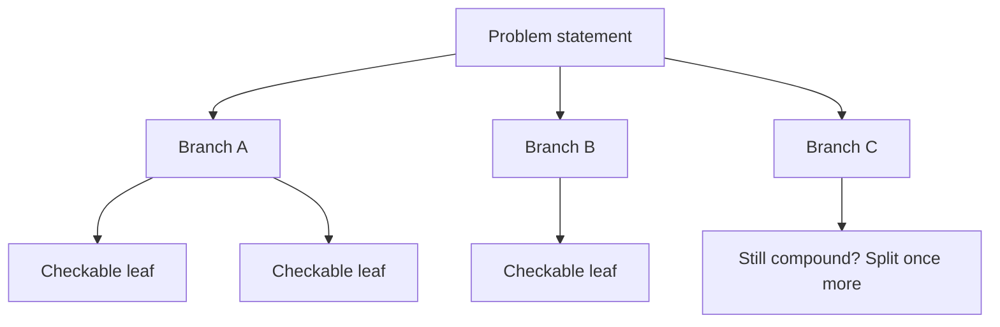

### Further reading

- [Issue Trees: The Definitive Guide — Crafting Cases](https://www.craftingcases.com/issue-tree-guide/)
- [How To Create Issue Trees / 5 Ways to be MECE](https://www.craftingcases.com/the-5-ways-to-be-mece-part-8/)
- [Issue trees — Untools](https://untools.co/issue-trees/)

---

## Abstraction laddering

Hayakawa’s ladder of abstraction, used as **why-up / how-down**. A mid-level statement is often in the wrong place. Why? moves toward purpose. How? moves toward mechanism. The point is to *place* the statement, not to climb forever. This is framing, not root-cause analysis.

### How to climb

1. Write the current statement on the middle rung.
2. Why-up 2–4 rungs. Each rung is a broader purpose. Stop before “make money.”
3. How-down 2–4 rungs. Each rung is a more concrete intervention. Stop before pixel lists.
4. Decide which rung is the work:
   - purpose / who-outcome → product / behavior
   - how pieces fit and fail → architecture
   - exact shapes → contracts / data
   - next shippable unit → tasks / phases
   - how we know we’re done → tests
5. Keep the statement in the correct layer, plus the placements you rejected. The initial statement may already be right.

### Shape

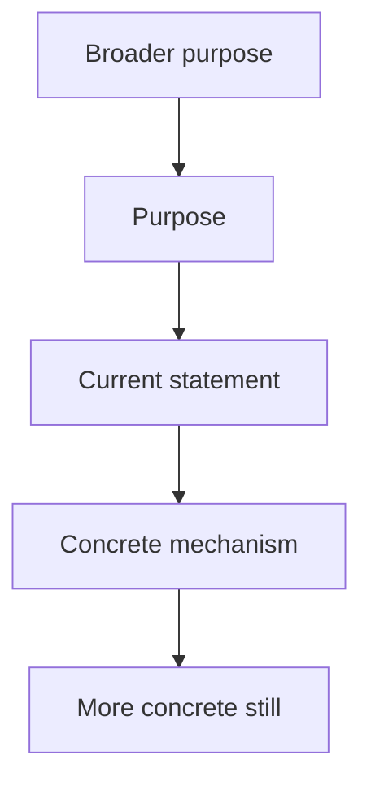

### Further reading

- [Abstraction Laddering — LUMA Institute](https://www.luma-institute.com/abstraction-laddering/)
- [Abstraction Laddering — Atomic Object](https://spin.atomicobject.com/problem-framing-abstraction-ladder/) (worked software example)
- Origin: Hayakawa, *Language in Thought and Action* (1939)
- [Abstraction laddering — Untools](https://untools.co/abstraction-laddering/)

---

## First principles

Separate what is true in this situation from analogy (“this is how people do it”). A first principle here is an **irreducible constraint**: it still holds if the current design is deleted. Write keepers as Meyer contracts, map reuse, invent only the gap, then **delete before add**. Craftsmanship is less surface area and sharper contracts — not Musk anecdotes or Five Whys chains.

Prefer writing constraints as contracts (Meyer) over ritual “Five Whys.” After you have irreducibles, default to reusing primitives that already satisfy them. Addition-by-subtraction / Occam lives here, not as a separate tool; behavior-preserving cleanup of existing code still routes to `subtract`. Interrupted, retried, or concurrent transitions belong in [state machines](#state-machines).

### How to rebuild from constraints

1. Name the claimed requirement or stack choice.
2. List constraints that remain if this design vanishes (physics, law, existing data contracts, SLO, threat model). Strike “how we did it last time.”
3. Write keepers as contracts:
   - **precondition** — caller must guarantee
   - **postcondition** — supplier must deliver
   - **invariant** — always true in observable states.
   Share policy definitions; keep independent validation at every required trust boundary. Remove a check only when it is redundant within the same trusted boundary; before deleting supplier-side enforcement, test a direct call that bypasses the caller.
4. For each invariant, name the existing primitive or library that already satisfies it. Reuse is the default.
5. **Delete before add.** Before inventing or growing lifecycle surface area: list what can be deleted, demoted, or reused. When net surface grows, require a `Removed / not built` note (or explicit “nothing to delete because…”).
6. Rebuild only the gap. Analogies (“like Netflix”) wait until steps 2–5 exist.
7. Failures to avoid: “users want speed” as an axiom; inventing what already exists (NIH); deleting tests or observability to “simplify.”

### Shape

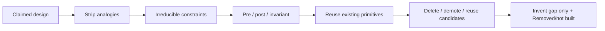

### Further reading

- Meyer, [Applying “Design by Contract”](https://se.inf.ethz.ch/~meyer/publications/computer/contract.pdf) (*Computer*, Oct 1992)
- [What is First Principles Thinking? — Farnam Street](https://fs.blog/first-principles/) — irreducibles vs analogy (skip Five Whys as the method)
- [First Principles — James Clear](https://jamesclear.com/first-principles) (worked decomposition)
- [First principles — Untools](https://untools.co/first-principles/)

---

## Cynefin

Snowden’s sense-making framework — not a 2×2 scorecard. Domains have **bounded applicability**: the domain *forbids* some next moves.

- **Ordered** (clear, complicated): cause and effect knowable
- **Unordered** (complex, chaotic): only in hindsight, or not at all
- **Confusion / disorder** (center): split the mess before picking a method

### How to use it as a gate

1. Ask: is cause-effect obvious, analyzable, only retrospective, or is the place on fire?
2. Stamp **one** domain, plus the forbidden next move:

| Domain | Recipe | Do | Do not |
| --- | --- | --- | --- |
| Clear | sense–categorize–respond | apply known fix / best practice | invent a new architecture |
| Complicated | sense–analyze–respond | analyze, then specify | skip the analysis; treat it as a fire drill |
| Complex | probe–sense–respond | time-boxed safe-to-fail spike | freeze a full PRD |
| Chaotic | act–sense–respond | stabilize, stop the bleed | write architecture |
| Confusion | split | carve into the other four | pick one method for the whole mess |

3. Re-label when the situation moves (stabilize chaos → complex; complacent “clear” can collapse into chaos).

### Shape

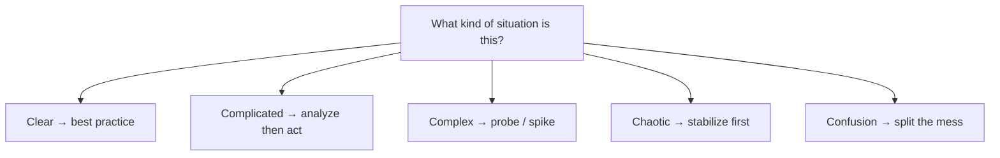

### Further reading

- [Cynefin Framework — Open Practice Library](https://openpracticelibrary.com/practice/cynefin-framework/)
- Snowden & Boone, [A Leader’s Framework for Decision Making](https://hbr.org/2007/11/a-leaders-framework-for-decision-making) (HBR Nov 2007)
- [cynefin.io](https://cynefin.io/wiki/Cynefin)
- [Wikipedia: Cynefin framework](https://en.wikipedia.org/wiki/Cynefin_framework)
- [Cynefin framework — Untools](https://untools.co/cynefin-framework/)

---

## OODA

Boyd: **Observe, Orient, Decide, Act** — with feedback, not a stage clock. **Orient is the work.** Boyd’s 1995 sketch labels Decide = hypothesis and Act = test. Skipping Decide is for trained intuition, not for an unknown bug. Speed is not the metric; a wrong Orient faster is just faster wrong.

Paired with scientific debugging (Zeller): one hypothesis, one prediction, one experiment, then look again.

### Debug loop

1. **Observe** — facts only: repro, logs, last-good commit, what changed. No patching yet.
2. Invent a hypothesis consistent with the observations (**Orient**).
3. Make a **prediction** the hypothesis requires.
4. **Decide / Act** — one experiment that would kill the hypothesis if false. Collecting more data counts. Not twelve changes in parallel.
5. If it matches, refine. If not, replace the hypothesis.
6. Keep a logbook row: hypothesis / prediction / experiment / observation / conclusion.
7. Count consecutive cycles without progress, not total experiments. A narrowed fault, eliminated candidate, or faithful reproducer resets the count. After three non-progress cycles, a budget limit, unavailable evidence, or missing authority, escalate with known facts, the blocker, and the next input needed. Resume when that is resolved.

### Shape

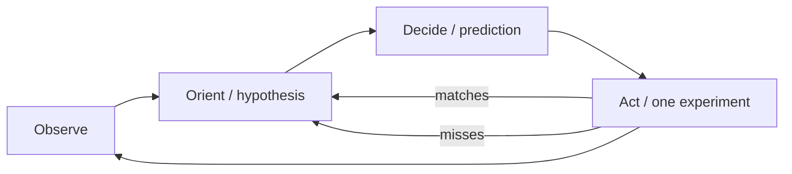

### Further reading

- Zeller, [*Why Programs Fail* ch.6 — Scientific Debugging](https://courses.cs.duke.edu/compsci308/current/readings/Zeller_Scientific_Debugging.pdf)
- Boyd, [The Essence of Winning and Losing](https://ooda.de/media/john_boyd_-_the_essence_of_winning_and_losing.pdf) (1995/96)
- [OODA for sysadmins — Server Fault](https://blog.serverfault.com/2012/07/18/ooda-for-sysadmins/)
- [The OODA Loop — StrategyU](https://strategyu.co/ooda-loop/)
- [OODA loop — Untools](https://untools.co/ooda-loop/)

---

## Zwicky box

Zwicky via Ritchey: **morphological analysis**. Decompose a problem into independent parameters, give each a range of values, and inspect the configurations. The box *generates* options; scoring comes after. Cross-consistency assessment (CCA) deletes pairwise incompatibilities so you do not walk enormous spaces by hand.

### How to run one

1. Name only genuine **independent** decision axes; counts such as 3–5 are examples, never quotas. Dependent axes (OS and “Linux-only feature”) invalidate the box.
2. Use feasible values only; binary axes are valid. Product of sizes is the formal space. Compare two designs directly when only two exist.
3. Pairwise CCA: logical contradictions first, then empirical. No “I don’t like it” yet.
4. Keep the internally consistent configurations that survive constraints, even if fewer than three. Stop generating options when the decision is supported; do not invent dimensions or relax constraints to fill a table.
5. Optional: weighted decision matrix **after** the box, with factors written before scores.
6. Failures to avoid: a huge box for simple CRUD; scoring first; skipping CCA (fake completeness).

### Shape

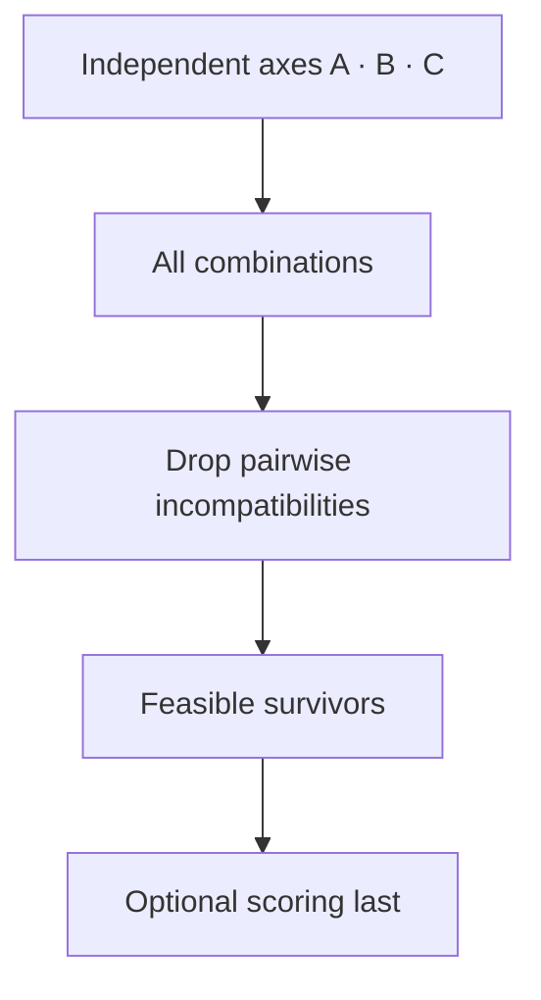

### Further reading

- [Morphological Box — SI Labs](https://www.si-labs.com/en/articles/morphological-box/) (includes CCA)
- Ritchey, [General Morphological Analysis](https://swemorph.com/ma.html) and [GMA PDF](https://www.swemorph.com/pdf/gma.pdf)
- [Zwicky box — Untools](https://untools.co/zwicky-box/)

---

## Minto Pyramid

Barbara Minto: **governing thought first**, then grouped arguments, then evidence under each argument. The reader can stop at any level and still have a coherent answer.

**SCQA** sets up the answer so it is not abrupt: Situation, Complication, Question, Answer (the answer *is* the governing thought). Groups are MECE. Prefer inductive “three reasons” over a long deductive chain. The governing thought is a *claim*, not a topic.

### How to write one

1. Write the governing thought as one sentence. If two sentences, two memos.
2. Optional SCQA lead-in, compressed to a few lines.
3. 2–4 arguments. Test: if all are true, the governing thought must be true. Overlap → merge. Doesn’t support the lead → cut.
4. Evidence under each argument, not in an appendix. Uncertainty stays in the governing thought (“X, unless open question 3”).
5. Stop-anywhere test: lead alone, lead + arguments, or full note — same takeaway.
6. Failures to avoid: twelve heading levels; pyramid as a substitute for evidence; using this for a personal narrative.

### Shape

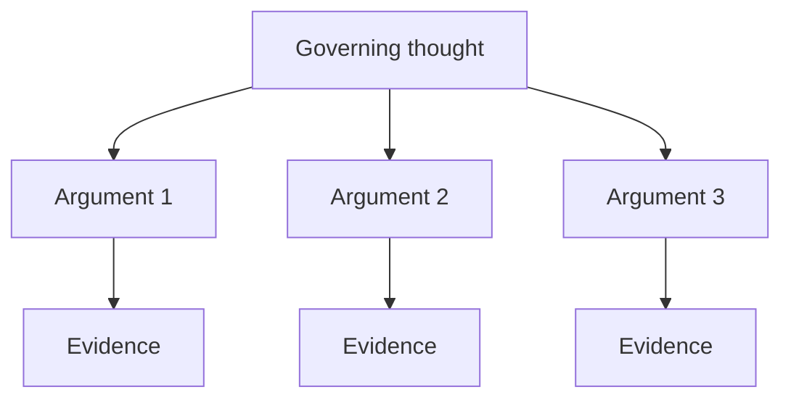

### Further reading

- [The Pyramid Principle — StrategyCase](https://strategycase.com/the-pyramid-principle-case-interview)
- Barbara Minto, *The Pyramid Principle* (book)
- [Minto Pyramid — Untools](https://untools.co/minto-pyramid/)

---

## Test bar

Untools / Chu ask “how confident am I in the problem and the solution?” For engineering work, rewrite the gate as:

**blast radius × evidence already in hand → required test layer**

A failing test is not value; a fix is. The ideal feedback loop is fast, reliable, and isolates the failure. Chu’s Experiment / Feature / Platform model still governs *tempo*. Fowler’s pyramid is the familiar cartoon, not the whole gate. Where the expected result comes from is [independent oracles](#independent-oracles).

### Layers

- **Unit** — isolated logic, fast, pins a corner. Default for pure functions. (SWE book *small*: one process, no I/O.)
- **Functional / integration** — several units together, real collaborators; mock the network not the design. (SWE book *medium*: one machine.)
- **Smoke** — the smallest deploy-blocking slice of the real system (health, login, one write-path). The e2e you refuse to skip.
- **E2E** — behaves like a user across the stack. Expensive and brittle. One per critical journey, not per ticket. (SWE book *large*: multi-machine.)

### How to choose

1. Name blast radius: who is hurt if this is wrong (data, auth, money, one internal tool).
2. Name evidence already in hand: repro rate, acceptance coverage, contract tests, last similar incident.
3. Name the kind of work: Experiment (optimize for learning) / Feature / Platform (quality bar is high).
4. Pick the **required** layer(s). High blast means auth, data, money, untrusted input, production path, or concurrency. It requires evidence of both boundary behavior (functional / integration) and the critical application path (smoke / e2e). One check may cover both claims if it actually exercises both; name that coverage. An unavailable path remains a reported gap, never an implicit waiver. Isolated change with strong unit evidence does not get a new browser suite.
5. Forbid duplicating lower-layer asserts at e2e. Thought experiment: you may write only 10 e2e — where?
6. If a high-level test fails, use the smallest faithful reproduction where feasible. Retain the boundary-level check when browser policy, deployment configuration, or distributed timing cannot be represented faithfully below it. Do not fabricate equivalent unit evidence.
7. Beyoncé rule: if you liked it, put a test on it.
8. Optional **RAT**: name the riskiest assumption → cheapest test that kills it.
9. Failures to avoid: confidence-as-logits; high confidence skips tests; low confidence skips shipping *and* skips tests; ice-cream cone of e2e. 70/20/10 is a first guess, not a quota.

### Shape

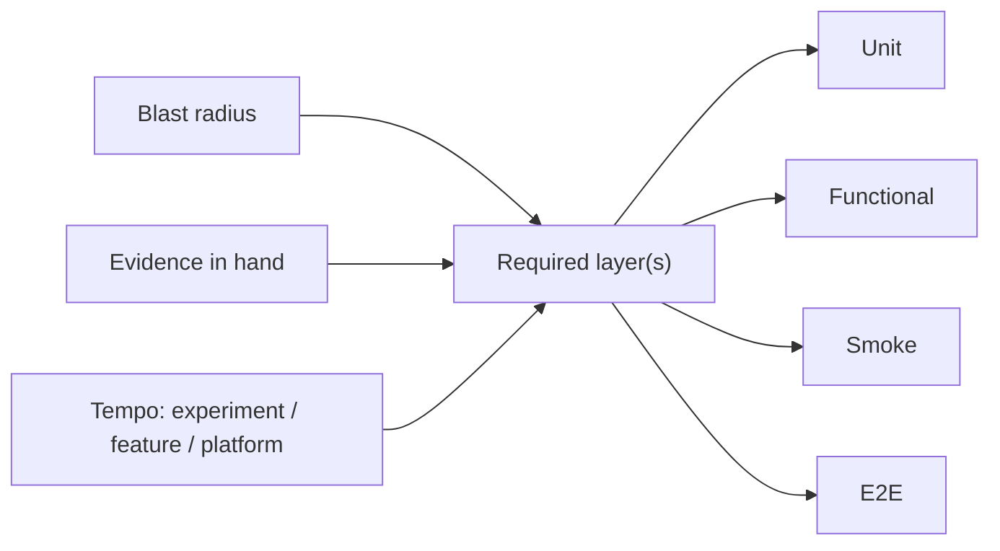

### Further reading

- Wacker, [Just Say No to More End-to-End Tests](https://testing.googleblog.com/2015/04/just-say-no-to-more-end-to-end-tests.html)
- [Software Engineering at Google, ch.11 Testing Overview](https://abseil.io/resources/swe-book/html/ch11.html) (small / medium / large; Beyoncé rule)
- Chu, [Product Management Mental Models](https://blackboxofpm.substack.com/p/product-management-mental-models-for-everyone-31e7828cb50b) (speed vs quality; Experiment / Feature / Platform)
- [Test Pyramid — Martin Fowler](https://martinfowler.com/bliki/TestPyramid.html)
- [Confidence determines speed vs. quality — Untools](https://untools.co/confidence-determines-speed-vs-quality/)

---

## Eigenquestions

Among a set of related questions, the **eigenquestion** is the most discriminating one — if answered, it answers or collapses the rest. Surface debates are often the wrong question. Use when stuck on a multi-question deadlock that should spawn a lasting principle — not on every ticket.

### How to use

1. Surface the deadlock; list related questions/choices (do not order by loudness).
2. Rank by: *if answered, what else falls?* Prefer discriminating over noisy.
3. Reframe if needed (rotate perspective; change the question).
4. Decide the eigenquestion first.
5. Cascade: write 1–3 principles/decisions that kill downstream bikesheds.
6. Park remaining questions as entailed or explicitly deferred.

**Stop:** one eigenquestion + 1–3 cascading decisions named; remaining items entailed or parked. **Not for every decision.**

### Shape

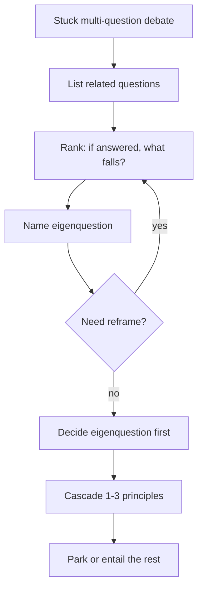

### Further reading

- Mehrotra & Hudson, [Eigenquestions: The Art of Framing Problems](https://docs.superhuman.com/@shishir/eigenquestions-the-art-of-framing-problems) (Superhuman handbook)
- Jenny Wen, [Figma Community: Eigenquestions](https://www.figma.com/community/file/1322597016029468610/eigenquestions)
---

## Feedback loops

Name the stock, flow, polarity (reinforcing **R** / balancing **B**), delay, and opposing loop that will fight the design — retries, caches, autoscaling, incident spirals, capacity. Optionally label one Kim archetype when it fits. One primer, not ten systems files. Intervention must name which link, delay, or goal changes.

### How to use

1. Name the **stock** (accumulator) and **flows** that fill/drain it (Meadows bathtub).
2. Name polarity: **R** (amplifies) or **B** (goal-seeking). Mark significant **delays**.
3. Name the **opposing** loop (what fights or limits the first).
4. Optional: match **one** Kim archetype if it fits — Fixes That Fail; Shifting the Burden; Limits to Growth / Limits to Success; Drifting Goals; Escalation; Success to the Successful; Tragedy of the Commons; Growth and Underinvestment.
5. State the intervention: which link to add/break, delay to shorten, or goal to make explicit.

**Stop:** one loop with opposing force named; intervention names the structural change. No essay.

Failures to avoid: “users tell friends” as a reinforcing loop without a stock; drawing arrows with no stock/delay; minting Connection Circles / Iceberg as separate tools (fold here).

### Shape

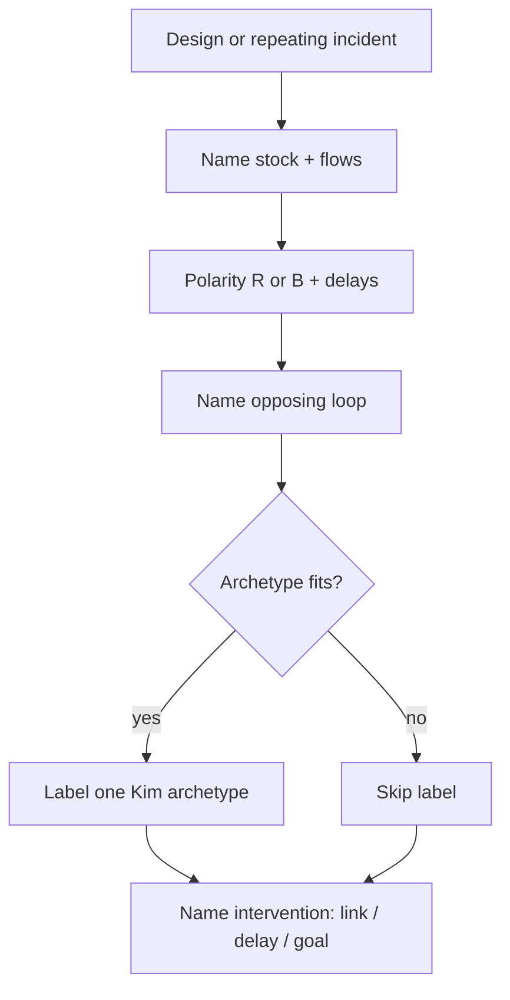

### Further reading

- Daniel H. Kim, *Systems Thinking Tools: A User’s Reference Guide* (Pegasus Communications, 1994/2000) — CLD, R/B, archetypes
- Meadows Project, [Systems Thinking Resources](https://donellameadows.org/systems-thinking-resources/) (bathtub / stock–flow); [Bathtubs 101 PDF](https://donellameadows.org/wp-content/userfiles/bathtubs101.pdf)

---

## Leverage points

Meadows’ ranked places to intervene in a system (#12 weakest → #1 strongest). Agents tune parameters (#12) and call it architecture. Ask: are we changing a constant, a feedback, a rule, or a goal? Prefer structural interventions (add/break link, shorten delay, make goal explicit) over constants. Loops describe structure; leverage ranks intervention altitude — keep them separate from [feedback loops](#feedback-loops).

### How to use

1. Classify the intervention against Meadows 12 (weak → strong):
   - **12** Constants, parameters, numbers
   - **11** Buffer sizes relative to flows
   - **10** Structure of material stocks and flows
   - **9** Lengths of delays relative to rate of change
   - **8** Strength of negative (balancing) feedback
   - **7** Gain around driving positive (reinforcing) feedback
   - **6** Structure of information flows (who sees what)
   - **5** Rules (incentives, constraints, permissions)
   - **4** Power to add/change/evolve/self-organize structure
   - **3** Goals of the system
   - **2** Mindset / paradigm
   - **1** Power to transcend paradigms
2. State why weaker ranks fail for this problem.
3. Prefer structural moves (≈ ranks 9–5, or goal #3 when genuine) over constants.
4. Write the concrete change that matches the claimed rank.

**Stop:** intervention matches the rank claimed; not “paradigm” as excuse to avoid a concrete change.

### Shape

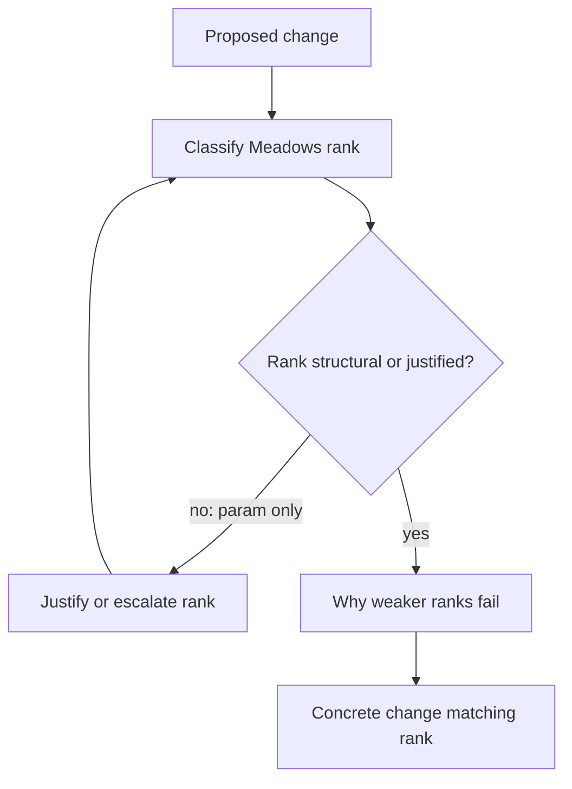

### Further reading

- Meadows, [Leverage Points: Places to Intervene in a System](https://donellameadows.org/archives/leverage-points-places-to-intervene-in-a-system/)
- Kim, *Systems Thinking Tools* (Pegasus) — prefer structural interventions; pairs with ranks above

---

## Specification by example

Turn each important MUST into observable examples before implementation invents the behavior. Ambiguous words (“robust”, “fast”, “handles failure”) survive until a normal, boundary, and failure case exist. The examples are the contract’s testable surface; they are not a suggested implementation.

### How to use

1. For each important MUST, name actor, trigger, input, output, and failure behavior.
2. Write three examples: **normal**, **boundary**, **failure**. A MUST with no example that could fail is incomplete.
3. Keep required behavior separate from a proposed mechanism.
4. Link each example to a verification method. Not every example needs a unit test.
5. When the implementation drifts, update the example only if the user changed intent.

**Stop:** each important MUST has normal, boundary, and failure examples. Skip ceremonial examples on a one-line typo fix.

Failures to avoid: examples that only restate the MUST; rewriting examples to match an accidental implementation; treating a suggested library as a requirement.

### Shape

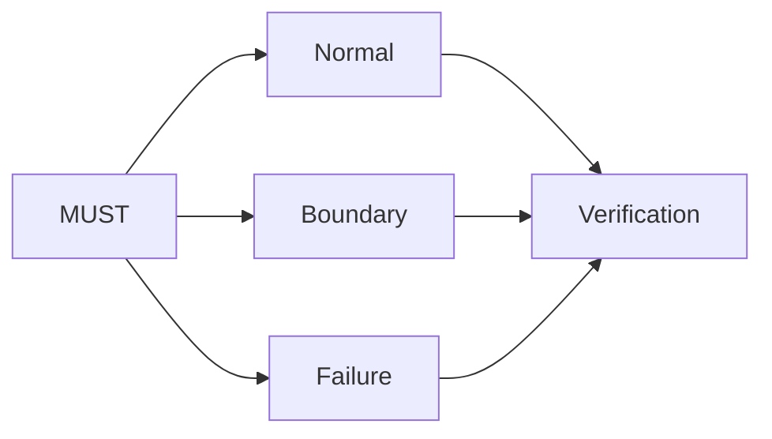

### Further reading

- [Cucumber: Example Mapping](https://cucumber.io/docs/bdd/example-mapping/)
- [NASA: writing good requirements](https://www.nasa.gov/reference/appendix-c-how-to-write-a-good-requirement/)

---

## Quality scenarios

A quality attribute (“scalable”, “reliable”) is not a decision until it has a stimulus, an environment, a required response, and a measure. One scenario is enough to reject a survivor or keep the smallest design that still holds. This is not a full ATAM workshop.

### How to use

1. Name the quality in one line (latency, durability, availability, modifiability, …).
2. Fill: source of stimulus → stimulus → operating environment → affected part → required response → measure.
3. Compare surviving designs against hard constraints first, then preferences.
4. Record the assumption that would reverse the choice.

**Stop:** one scenario the winner must meet; ordinary CRUD skips this.

Failures to avoid: averaging away a hard requirement in a score; treating “microservices” as a quality; a scenario with no measure.

### Shape

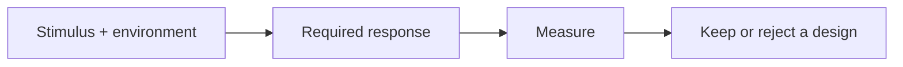

### Further reading

- [SEI: reasoning about software quality attributes](https://www.sei.cmu.edu/library/reasoning-about-software-quality-attributes/)
- [SEI: steps in ATAM](https://www.sei.cmu.edu/library/steps-in-an-architecture-tradeoff-analysis-method-quality-attribute-models-and-analysis/)
- [Nygard: documenting architecture decisions](https://cognitect.com/blog/2011/11/15/documenting-architecture-decisions)

---

## State machines

Pre/post/invariant live in [first principles](#first-principles). This primer is the transitions those contracts must survive: interruption, retry, concurrency, and forbidden paths. A happy-path narrative hides the defects.

### How to use

1. List meaningful states, transition triggers, guards, and side effects. Include failure and recovery.
2. State invariants separately from examples. Distinguish safety (never) from liveness (eventually, under assumptions).
3. Check interrupted, repeated, and concurrent transitions — not only the happy path.
4. Derive checks from allowed transitions, forbidden transitions, and partial sequences.

**Stop:** a small table of states × those three interruptions. Skip for stateless CRUD.

Failures to avoid: naming a state `completed` and calling it exactly-once; proving the diagram instead of the implementation; omitting cancellation.

### Shape

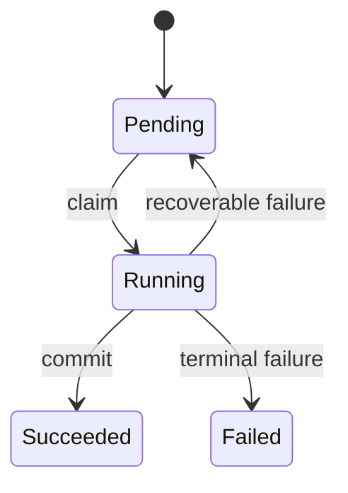

### Further reading

- [Amazon engineers: formal methods in practice](https://lamport.azurewebsites.net/tla/formal-methods-amazon.pdf)
- Meyer, [Applying “Design by Contract”](https://se.inf.ethz.ch/~meyer/publications/computer/contract.pdf) (pre/post/invariant)

---

## Fault isolation

Narrow the location or conditions of a failure before inventing a hypothesis about the whole subsystem. Bisection searches an ordered space (commits) with a reliable good/bad test. Delta debugging shrinks a failing input or configuration while the same failure remains.

### How to use

1. Define the exact failure predicate. Establish repeatability.
2. Separate environment from the artifact under investigation.
3. Reduce: bisect history, or drop input/config subsets. Keep only reductions that preserve **this** failure.
4. Confirm the minimized case still matches the original symptom before using it to justify a fix.

**Stop:** a minimized reproducer plus evidence it is the same bug. Skip when the case is already tiny.

Failures to avoid: a reducer that preserves a different error; treating one flaky observation as binary; shotgun-patching the unreduced artifact.

### Shape

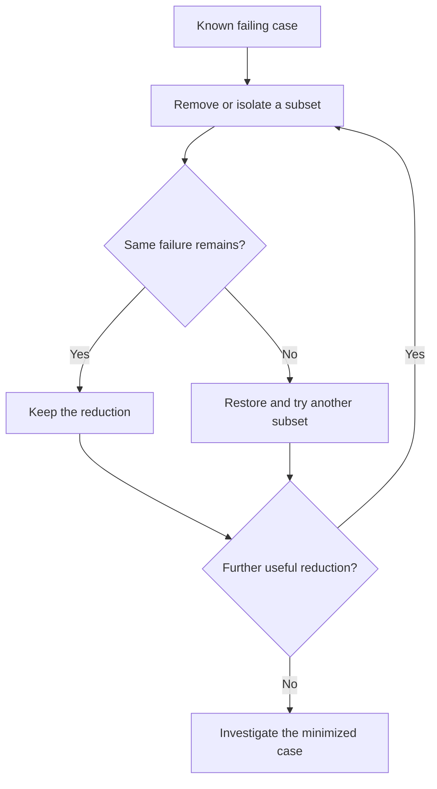

### Further reading

- [Zeller: Delta Debugging](https://www.debuggingbook.org/html/DeltaDebugger.html)
- [Git: bisect](https://git-scm.com/docs/git-bisect)
- [Google SRE: effective troubleshooting](https://sre.google/sre-book/effective-troubleshooting/)

---

## Independent oracles

[Test bar](#test-bar) chooses the layer. This primer chooses the **expected result**. A check whose oracle is the implementation under test can only reproduce the same mistake.

### How to use

1. Name where the expected result comes from: the contract / example, a trusted reference, or an independently derived property.
2. If it was read from the code under test, it is not an oracle. Get it from the MUST, a fixture, a spec, or a property that would still hold if this code were deleted.
3. Do not weaken the assertion, timeout, or error report to make the check pass.
4. A regression test should fail for the defect it claims to catch.

**Stop:** every material check has a named oracle source. Skip restating this on a proof that already cites the contract example.

Failures to avoid: round-trip tests that both sides get wrong the same way; snapshots that lock implementation; “the test matches the code, so the code is correct.”

### Shape

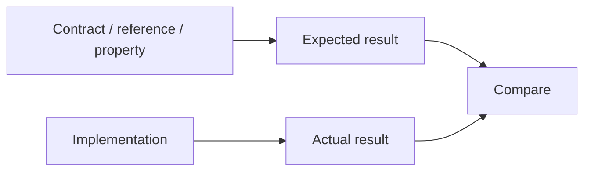

### Further reading

- [Software Engineering at Google, ch.11 Testing Overview](https://abseil.io/resources/swe-book/html/ch11.html)
- [Google SRE: testing for reliability](https://sre.google/sre-book/testing-reliability/)

---

## Threat modeling

Ask what is being built, what can go wrong, what will be done about it, and whether that is adequate. For Marvin, the smallest useful pass is a **trust-boundary challenge** on high-blast work (auth, data, money, untrusted input). STRIDE is a prompt list, not a finding quota.

### How to use

1. Name assets, trust boundaries, entry points, and authorized actors.
2. Trace untrusted input to privileged effects. Untrusted artifacts are data, not executable authority.
3. Construct **one** concrete abuse or failure scenario.
4. Inspect the control. Report location, trigger, consequence, evidence, and a check — or report no finding.
5. STRIDE prompts: spoofing, tampering, repudiation, information disclosure, denial of service, elevation of privilege.

**Stop:** one scenario + control + evidence (or an explicit “no finding” with scope). Skip for low-blast internal tools with no trust boundary.

Failures to avoid: requiring N bugs; treating a second pass by the same model as independent assurance; assuming an authenticated request is authorized for every object.

### Shape

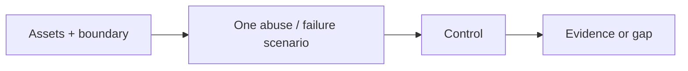

### Further reading

- [OWASP: Threat Modeling](https://owasp.org/www-community/Threat_Modeling)
- [Threat Modeling Manifesto](https://www.threatmodelingmanifesto.org/)
- [Microsoft: STRIDE](https://learn.microsoft.com/en-us/archive/msdn-magazine/2006/november/uncover-security-design-flaws-using-the-stride-approach)

---

## When to reach for which

- Unknown domain / wrong next move → **Cynefin** first.
- Stuck on which question → **Eigenquestions**; stuck splitting a given problem → **Issue trees**.
- Spec layer wrong → **Abstraction laddering**; claim buried → **Minto Pyramid**; MUST without a failing example → **Specification by example**.
- Architecture options → **Zwicky box**; which option holds → **Quality scenarios**; where to intervene → **Leverage points**; dynamics fighting you → **Feedback loops**; retries/jobs/cancellation → **State machines**.
- Before inventing code → **First principles** (contracts + reuse + delete).
- Live bug → **OODA**; large repro or history → **Fault isolation**; what tests to write → **Test bar**; where the expected result comes from → **Independent oracles**; auth/data/money → **Threat modeling**.
