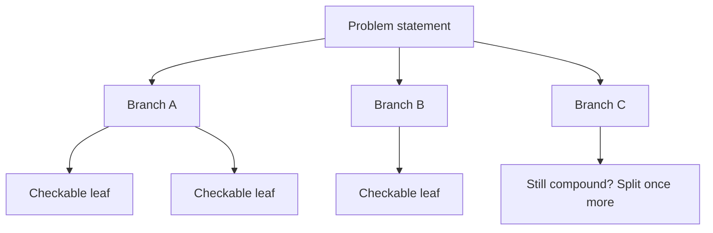
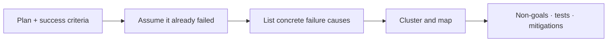
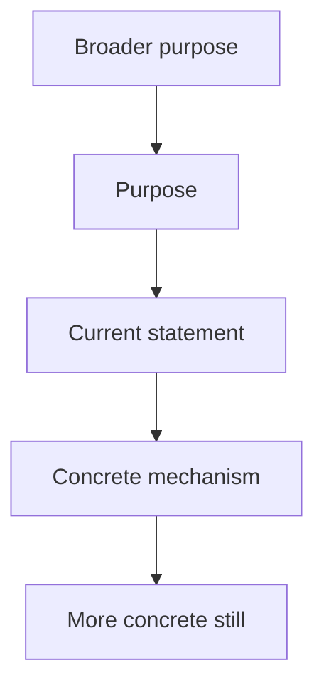
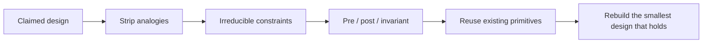
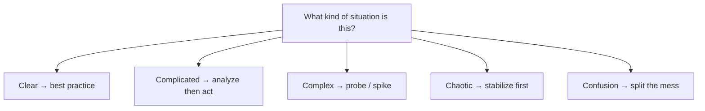
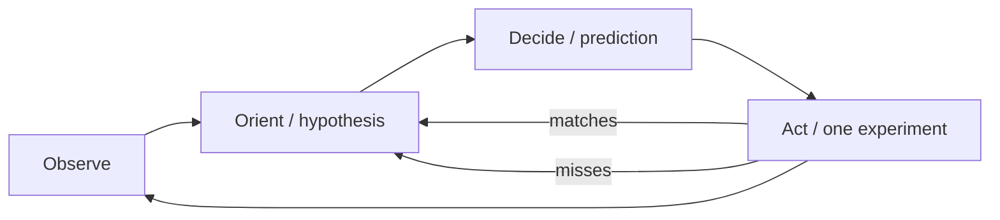
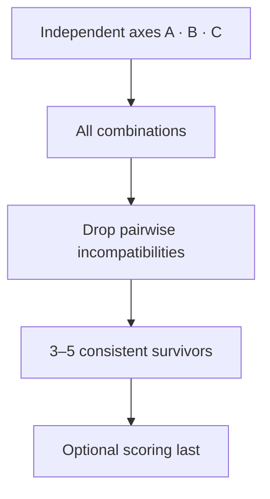
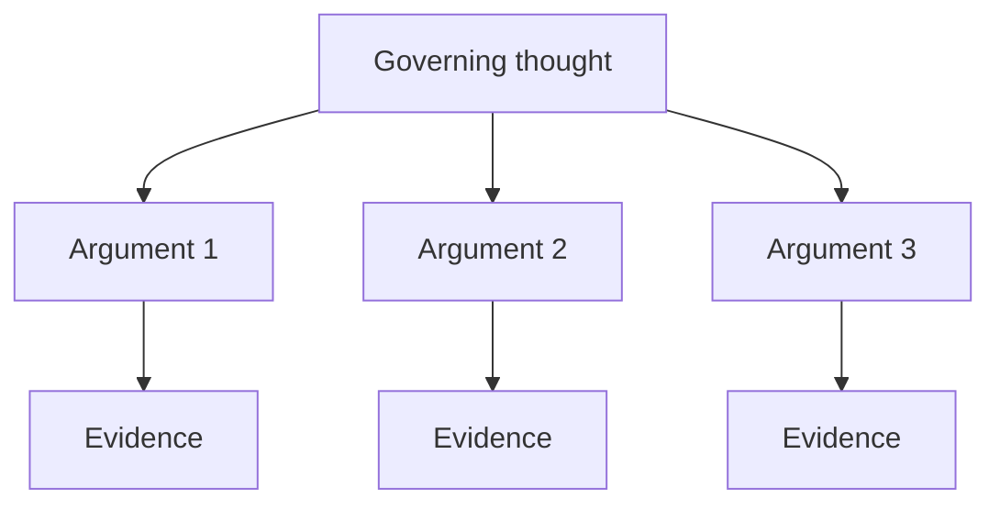
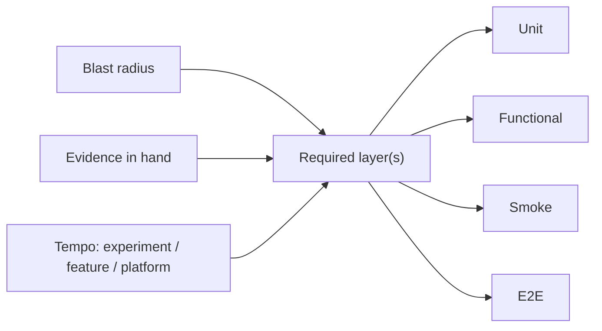

# Thinking tools

Nine frameworks for framing problems, choosing designs, debugging, and deciding how much proof is enough. Each section is a standalone primer. Icons from [Untools](https://untools.co).

## Where they show up in Marvin

| Tool | Bound the ask | Pack light | Prove it | Find the fault | Subtract |
| --- | :---: | :---: | :---: | :---: | :---: |
| [Issue trees](#issue-trees) | x | | x | x | |
| [Inversion](#inversion) | x | | x | x | |
| [Abstraction laddering](#abstraction-laddering) | x | x | | | |
| [First principles](#first-principles) | x | x | | | x |
| [Cynefin](#cynefin) | x | x | | x | |
| [OODA](#ooda) | | | | x | |
| [Zwicky box](#zwicky-box) | | x | | | |
| [Minto Pyramid](#minto-pyramid) | x | | | | |
| [Test bar](#test-bar) | | x | x | | |

---

## Issue trees

A **MECE** map of a problem or of its solutions. Branches do not overlap (**mutually exclusive**). Together they cover the whole (**collectively exhaustive**).

Two kinds — do not mix them in one tree:

- **Why-tree** — hypotheses for a failure
- **How-tree** — categories of interventions

A leaf is done when it is a check you can run, not a theme.

### How to build one

1. Write one specific problem sentence. If two problems hide in it, split them first.
2. Pick why-tree (diagnose) or how-tree (design / tests).
3. First layer: one MECE split. Prefer algebraic (`A = B × C`), process (the actual pipeline), or a true conceptual split. Opposite-words (internal vs external) only as a last resort.
4. Each child must fully explain its parent. Stop a branch when the leaf is falsifiable: a query, a test, a probe.
5. Prioritize by data or by which leaf would eliminate the most of the tree. Do not deepen every branch.
6. Stop at ≤2 levels unless a leaf is still a compound claim.

### Quality checks

- Separate different problems early.
- Build one part at a time; every part MECE.
- Toothbrush test: if the tree would look the same for a toothbrush company, it is too generic.
- Every part is eliminative. Ask before you guess.

### Shape

### Further reading

- [Issue Trees: The Definitive Guide — Crafting Cases](https://www.craftingcases.com/issue-tree-guide/)
- [How To Create Issue Trees / 5 Ways to be MECE](https://www.craftingcases.com/the-5-ways-to-be-mece-part-8/)
- [Issue trees — Untools](https://untools.co/issue-trees/)

---

## Inversion

Solve the problem backwards. Jacobi / Munger: invert, always invert — it is often easier to list how to fail than how to succeed.

Klein’s **pre-mortem** is the team procedure: prospective hindsight. Do not ask “what might go wrong?” Assert “it is later; this already failed; explain why.”

### Pre-mortem steps

1. Brief the plan, constraints, and success criteria. No debate yet.
2. Announce: we are now in the future; the change shipped; it was a fiasco. Nobody may object to a reason.
3. Independently write numbered failure causes (2–10 minutes). System-specific, not “the cloud dies.”
4. Round-robin: each person voices one unused reason until the list is empty. Record.
5. Cluster. Each surviving item must map to a non-goal, a test, or a mitigation.
6. Stop when every item is falsifiable.

### Shape

### Further reading

- [Inversion — Farnam Street](https://fs.blog/inversion/) (Jacobi → Munger)
- [Pre-Mortem — The Uncertainty Project](https://www.theuncertaintyproject.org/tools/pre-mortem) (Klein’s steps, free)
- Canonical, paywalled: Klein, [Performing a Project Premortem](https://hbr.org/2007/09/performing-a-project-premortem) (HBR Sep 2007)
- [Inversion — Untools](https://untools.co/inversion/)

---

## Abstraction laddering

Hayakawa’s ladder of abstraction, used as **why-up / how-down**. A mid-level statement is often in the wrong place. Why? moves toward purpose. How? moves toward mechanism. The point is to *place* the statement, not to climb forever. This is framing, not root-cause analysis.

### How to climb

1. Write the current statement on the middle rung.
2. Why-up 2–4 rungs. Each rung is a broader purpose. Stop before “make money.”
3. How-down 2–4 rungs. Each rung is a more concrete intervention. Stop before pixel lists.
4. Decide which rung is the work:
   - purpose / who-outcome → product / behavior
   - how pieces fit and fail → architecture
   - exact shapes → contracts / data
   - next shippable unit → tasks / phases
   - how we know we’re done → tests
5. Keep the statement in the correct layer, plus the placements you rejected. The initial statement may already be right.

### Shape

### Further reading

- [Abstraction Laddering — LUMA Institute](https://www.luma-institute.com/abstraction-laddering/)
- [Abstraction Laddering — Atomic Object](https://spin.atomicobject.com/problem-framing-abstraction-ladder/) (worked software example)
- Origin: Hayakawa, *Language in Thought and Action* (1939)
- [Abstraction laddering — Untools](https://untools.co/abstraction-laddering/)

---

## First principles

Separate what is true in this situation from analogy (“this is how people do it”). A first principle here is an **irreducible constraint**: it still holds if the current design is deleted. Then rebuild.

Prefer writing constraints as contracts (Meyer) over ritual “Five Whys.” After you have irreducibles, default to reusing primitives that already satisfy them.

### How to rebuild from constraints

1. Name the claimed requirement or stack choice.
2. List constraints that remain if this design vanishes (physics, law, existing data contracts, SLO, threat model). Strike “how we did it last time.”
3. Write keepers as contracts:
   - **precondition** — caller must guarantee
   - **postcondition** — supplier must deliver
   - **invariant** — always true in observable states  
   One check lives in one place — not both caller and supplier.
4. For each invariant, name the existing primitive or library that already satisfies it. Reuse is the default.
5. Rebuild. Analogies (“like Netflix”) wait until steps 2–4 exist.
6. Failures to avoid: “users want speed” as an axiom; inventing what already exists (NIH).

### Shape

### Further reading

- Meyer, [Applying “Design by Contract”](https://se.inf.ethz.ch/~meyer/publications/computer/contract.pdf) (*Computer*, Oct 1992)
- [What is First Principles Thinking? — Farnam Street](https://fs.blog/first-principles/) — irreducibles vs analogy (skip Five Whys as the method)
- [First Principles — James Clear](https://jamesclear.com/first-principles) (worked decomposition)
- [First principles — Untools](https://untools.co/first-principles/)

---

## Cynefin

Snowden’s sense-making framework — not a 2×2 scorecard. Domains have **bounded applicability**: the domain *forbids* some next moves.

- **Ordered** (clear, complicated): cause and effect knowable
- **Unordered** (complex, chaotic): only in hindsight, or not at all
- **Confusion / disorder** (center): split the mess before picking a method

### How to use it as a gate

1. Ask: is cause-effect obvious, analyzable, only retrospective, or is the place on fire?
2. Stamp **one** domain, plus the forbidden next move:

| Domain | Recipe | Do | Do not |
| --- | --- | --- | --- |
| Clear | sense–categorize–respond | apply known fix / best practice | invent a new architecture |
| Complicated | sense–analyze–respond | analyze, then specify | skip the analysis; treat it as a fire drill |
| Complex | probe–sense–respond | time-boxed safe-to-fail spike | freeze a full PRD |
| Chaotic | act–sense–respond | stabilize, stop the bleed | write architecture |
| Confusion | split | carve into the other four | pick one method for the whole mess |

3. Re-label when the situation moves (stabilize chaos → complex; complacent “clear” can collapse into chaos).

### Shape

### Further reading

- [Cynefin Framework — Open Practice Library](https://openpracticelibrary.com/practice/cynefin-framework/)
- Snowden & Boone, [A Leader’s Framework for Decision Making](https://hbr.org/2007/11/a-leaders-framework-for-decision-making) (HBR Nov 2007)
- [cynefin.io](https://cynefin.io/wiki/Cynefin)
- [Wikipedia: Cynefin framework](https://en.wikipedia.org/wiki/Cynefin_framework)
- [Cynefin framework — Untools](https://untools.co/cynefin-framework/)

---

## OODA

Boyd: **Observe, Orient, Decide, Act** — with feedback, not a stage clock. **Orient is the work.** Boyd’s 1995 sketch labels Decide = hypothesis and Act = test. Skipping Decide is for trained intuition, not for an unknown bug. Speed is not the metric; a wrong Orient faster is just faster wrong.

Paired with scientific debugging (Zeller): one hypothesis, one prediction, one experiment, then look again.

### Debug loop

1. **Observe** — facts only: repro, logs, last-good commit, what changed. No patching yet.
2. Invent a hypothesis consistent with the observations (**Orient**).
3. Make a **prediction** the hypothesis requires.
4. **Decide / Act** — one experiment that would kill the hypothesis if false. Collecting more data counts. Not twelve changes in parallel.
5. If it matches, refine. If not, replace the hypothesis.
6. Keep a logbook row: hypothesis / prediction / experiment / observation / conclusion.
7. Loop ≤3 cycles, then escalate. After ~10 minutes of guessing, go formal.

### Shape

### Further reading

- Zeller, [*Why Programs Fail* ch.6 — Scientific Debugging](https://courses.cs.duke.edu/compsci308/current/readings/Zeller_Scientific_Debugging.pdf)
- Boyd, [The Essence of Winning and Losing](https://ooda.de/media/john_boyd_-_the_essence_of_winning_and_losing.pdf) (1995/96)
- [OODA for sysadmins — Server Fault](https://blog.serverfault.com/2012/07/18/ooda-for-sysadmins/)
- [The OODA Loop — StrategyU](https://strategyu.co/ooda-loop/)
- [OODA loop — Untools](https://untools.co/ooda-loop/)

---

## Zwicky box

Zwicky via Ritchey: **morphological analysis**. Decompose a problem into independent parameters, give each a range of values, and inspect the configurations. The box *generates* options; scoring comes after. Cross-consistency assessment (CCA) deletes pairwise incompatibilities so you do not walk enormous spaces by hand.

### How to run one

1. Name 3–5 **independent** axes. Dependent axes (OS and “Linux-only feature”) invalidate the box.
2. At least 3 values each. Product of sizes is the formal space.
3. Pairwise CCA: logical contradictions first, then empirical. No “I don’t like it” yet.
4. Keep 3–5 internally consistent configs that survive constraints.
5. Optional: weighted decision matrix **after** the box, with factors written before scores.
6. Failures to avoid: a huge box for simple CRUD; scoring first; skipping CCA (fake completeness).

### Shape

### Further reading

- [Morphological Box — SI Labs](https://www.si-labs.com/en/articles/morphological-box/) (includes CCA)
- Ritchey, [General Morphological Analysis](https://swemorph.com/ma.html) and [GMA PDF](https://www.swemorph.com/pdf/gma.pdf)
- [Zwicky box — Untools](https://untools.co/zwicky-box/)

---

## Minto Pyramid

Barbara Minto: **governing thought first**, then grouped arguments, then evidence under each argument. The reader can stop at any level and still have a coherent answer.

**SCQA** sets up the answer so it is not abrupt: Situation, Complication, Question, Answer (the answer *is* the governing thought). Groups are MECE. Prefer inductive “three reasons” over a long deductive chain. The governing thought is a *claim*, not a topic.

### How to write one

1. Write the governing thought as one sentence. If two sentences, two memos.
2. Optional SCQA lead-in, compressed to a few lines.
3. 2–4 arguments. Test: if all are true, the governing thought must be true. Overlap → merge. Doesn’t support the lead → cut.
4. Evidence under each argument, not in an appendix. Uncertainty stays in the governing thought (“X, unless open question 3”).
5. Stop-anywhere test: lead alone, lead + arguments, or full note — same takeaway.
6. Failures to avoid: twelve heading levels; pyramid as a substitute for evidence; using this for a personal narrative.

### Shape

### Further reading

- [The Pyramid Principle — StrategyCase](https://strategycase.com/the-pyramid-principle-case-interview)
- Barbara Minto, *The Pyramid Principle* (book)
- [Minto Pyramid — Untools](https://untools.co/minto-pyramid/)

---

## Test bar

Untools / Chu ask “how confident am I in the problem and the solution?” For engineering work, rewrite the gate as:

**blast radius × evidence already in hand → required test layer**

A failing test is not value; a fix is. The ideal feedback loop is fast, reliable, and isolates the failure. Chu’s Experiment / Feature / Platform model still governs *tempo*. Fowler’s pyramid is the familiar cartoon, not the whole gate.

### Layers

- **Unit** — isolated logic, fast, pins a corner. Default for pure functions. (SWE book *small*: one process, no I/O.)
- **Functional / integration** — several units together, real collaborators; mock the network not the design. (SWE book *medium*: one machine.)
- **Smoke** — the smallest deploy-blocking slice of the real system (health, login, one write-path). The e2e you refuse to skip.
- **E2E** — behaves like a user across the stack. Expensive and brittle. One per critical journey, not per ticket. (SWE book *large*: multi-machine.)

### How to choose

1. Name blast radius: who is hurt if this is wrong (data, auth, money, one internal tool).
2. Name evidence already in hand: repro rate, acceptance coverage, contract tests, last similar incident.
3. Name the kind of work: Experiment (optimize for learning) / Feature / Platform (quality bar is high).
4. Pick the **required** layer(s). High blast always includes functional + a smoke / e2e path even when you “feel sure.” Isolated change with strong unit evidence does not get a new browser suite.
5. If a high-level test fails: replicate it as a unit / functional test first, then fix.
6. Beyoncé rule: if you liked it, put a test on it.
7. Failures to avoid: high confidence skips tests; low confidence skips shipping *and* skips tests. 70/20/10 is a first guess, not a quota.

### Shape

### Further reading

- Wacker, [Just Say No to More End-to-End Tests](https://testing.googleblog.com/2015/04/just-say-no-to-more-end-to-end-tests.html)
- [Software Engineering at Google, ch.11 Testing Overview](https://abseil.io/resources/swe-book/html/ch11.html) (small / medium / large; Beyoncé rule)
- Chu, [Product Management Mental Models](https://blackboxofpm.substack.com/p/product-management-mental-models-for-everyone-31e7828cb50b) (speed vs quality; Experiment / Feature / Platform)
- [Test Pyramid — Martin Fowler](https://martinfowler.com/bliki/TestPyramid.html)
- [Confidence determines speed vs. quality — Untools](https://untools.co/confidence-determines-speed-vs-quality/)
